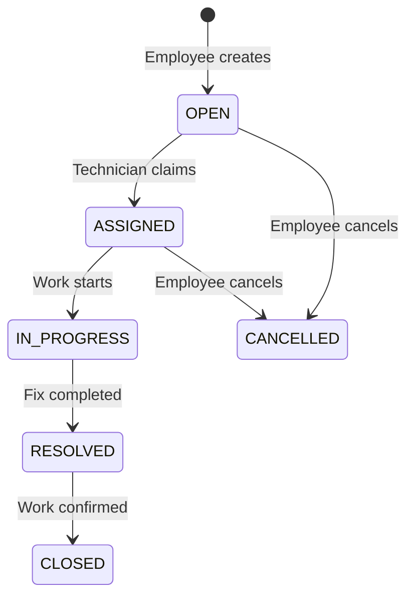

# HelpHub — Smart Service Desk

HelpHub is a portfolio-ready IT service desk application with secure employee and support-team workflows. Employees can register, create requests, track them, edit active tickets, and cancel requests. Technicians and administrators receive a shared work queue where they can claim and progress tickets through a guarded lifecycle.

## Highlights

- JWT authentication with BCrypt password hashing and 15-minute access tokens
- Role-based authorization for `EMPLOYEE`, `TECHNICIAN`, and `ADMINISTRATOR`
- Ticket creation, search, detail, update, cancellation, assignment, and status workflow
- Responsive React dashboard with accessible forms and clear loading/error states
- PostgreSQL schema managed by versioned Flyway migrations
- Spring Boot integration tests and automated frontend lint/build checks
- Multi-stage production containers, health checks, and GitHub Actions CI
- Optional local demo accounts—disabled by default

## Technology

| Area | Stack |
| --- | --- |
| Frontend | React 19, TypeScript, Vite, React Router, React Hook Form, Zod, Lucide |
| Backend | Java 21, Spring Boot 4, Spring Security, Spring Data JPA, Flyway |
| Data | PostgreSQL 18 |
| Delivery | Docker Compose, Nginx, GitHub Actions |

## Quick start with Docker

Requirements: Docker Desktop with Compose.

1. Copy `.env.example` to `.env`.
2. Replace `POSTGRES_PASSWORD` with a strong local password.
3. Generate a JWT secret in PowerShell:

   ```powershell
   $bytes = New-Object byte[] 32
   [Security.Cryptography.RandomNumberGenerator]::Fill($bytes)
   [Convert]::ToBase64String($bytes)
   ```

4. Paste the generated value into `JWT_SECRET` in `.env`.
5. Start all services:

   ```powershell
   docker compose up --build
   ```

6. Open [http://localhost:5173](http://localhost:5173). The API health endpoint is [http://localhost:8080/actuator/health](http://localhost:8080/actuator/health).

Stop the stack with `docker compose down`. Add `-v` only when you intentionally want to delete the local database volume.

## Demo roles

For local portfolio demonstrations only, set these values in `.env` before startup:

```properties
DEMO_SEED_ENABLED=true
DEMO_PASSWORD=ChooseYourOwnDemoPassword123!
```

The application creates these accounts once:

| Role | Email |
| --- | --- |
| Employee | `employee@helphub.demo` |
| Technician | `technician@helphub.demo` |
| Administrator | `admin@helphub.demo` |

All three use the password you set in `DEMO_PASSWORD`. Demo seeding defaults to `false` and should remain disabled in production.

## Local development

Start PostgreSQL:

```powershell
docker compose up -d postgres
```

Run the backend from `backend`:

```powershell
.\mvnw.cmd spring-boot:run
```

Run the frontend from `frontend` in another terminal:

```powershell
npm ci
npm run dev
```

Vite proxies `/api` to `http://localhost:8080`.

## Verification

Backend (requires PostgreSQL and Java 21):

```powershell
Set-Location .\backend
.\mvnw.cmd test
```

Frontend:

```powershell
Set-Location .\frontend
npm ci
npm run lint
npm run build
```

## Ticket lifecycle



Invalid transitions return HTTP `409 Conflict`. Requesters can only access their own tickets; staff endpoints require a technician or administrator role.

## API overview

| Method | Endpoint | Access |
| --- | --- | --- |
| `POST` | `/api/v1/auth/register` | Public |
| `POST` | `/api/v1/auth/login` | Public |
| `GET` | `/api/v1/users/me` | Authenticated |
| `GET`, `POST` | `/api/v1/tickets` | Employee-owned tickets |
| `GET`, `PATCH` | `/api/v1/tickets/{id}` | Ticket owner |
| `POST` | `/api/v1/tickets/{id}/cancel` | Ticket owner |
| `GET` | `/api/v1/staff/tickets` | Technician/Admin |
| `POST` | `/api/v1/staff/tickets/{id}/claim` | Technician/Admin |
| `PATCH` | `/api/v1/staff/tickets/{id}/status` | Assigned Technician/Admin |

Error responses use one consistent shape with timestamp, HTTP status, message, path, and field-level validation errors.

## Repository layout

```text
backend/                 Spring Boot API and tests
frontend/                React application and Nginx config
docs/                    Architecture decisions and technical notes
.github/workflows/       Continuous integration
compose.yaml             PostgreSQL + backend + frontend
```

See [docs/architecture.md](docs/architecture.md) for the system design and security boundaries. The complete machine-readable contract is in [docs/openapi.yaml](docs/openapi.yaml).
