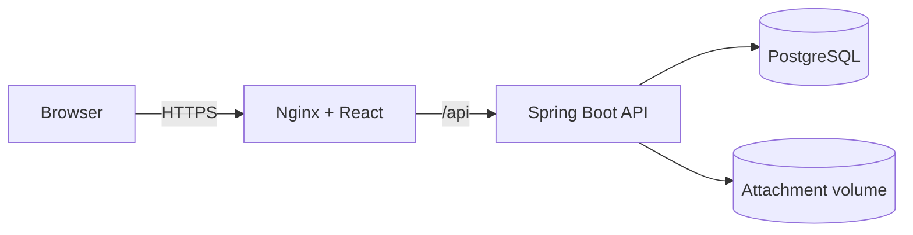

# Architecture

## System context

HelpHub uses a conventional three-tier architecture:

1. The React single-page application renders employee and staff workspaces.
2. Nginx serves static assets and proxies `/api` to Spring Boot in containers; Vite provides the equivalent proxy during development.
3. Spring Boot validates JWTs, enforces ownership and role rules, applies business transitions, and persists through JPA.
4. PostgreSQL stores users, roles, assignments, tickets, activity history, and notifications; Flyway owns schema evolution.

## Backend boundaries

- `identity`: registration, authentication, user roles, current-user data, and user notifications.
- `security`: HMAC JWT encoding/decoding and conversion of the `roles` claim into Spring authorities.
- `ticket`: ticket aggregate, requester operations, staff operations, collaboration timeline, audit events, repositories, and REST representations.
- `common.web`: consistent validation and application error responses.

Controllers translate HTTP messages, services enforce business rules inside transactions, entities protect their own invariants, and repositories isolate persistence.

## Authorization model

- Public access is limited to registration, login, and health probes.
- Every application endpoint requires a valid signed JWT.
- Requester queries always include the authenticated user ID, preventing cross-account ticket access.
- Staff endpoints use method authorization for `TECHNICIAN` and `ADMINISTRATOR`.
- Administration endpoints require `ADMINISTRATOR` and protect administrators from removing or locking their own access.
- A staff member must claim a ticket before changing its status.
- Internal notes are returned only to technicians and administrators; requester comments remain visible to both sides.
- Notification lookups are always scoped to the authenticated recipient.
- Attachment metadata is stored in PostgreSQL, while file bytes use generated names in a non-public storage directory. Downloads repeat ticket ownership/role authorization.
- Attachment uploads use a strict type allowlist, signature checks, and a 5 MB limit. Production deployments should additionally scan files for malware before release.
- Secrets are supplied by environment variables and never committed.

## Operational design

- Containers run as non-root where supported.
- Compose waits for database and backend health before starting dependants.
- Backend schema validation catches drift between JPA mappings and migrations.
- CI builds both applications and runs backend tests against a real PostgreSQL service.
- Demo accounts require explicit opt-in and a caller-provided password.

## Known production extensions

This release is intentionally a focused service-desk MVP. A production rollout should add refresh-token rotation or an external identity provider, managed object storage plus malware scanning, rate limiting at the edge, centralized observability, email or push delivery, and managed secret storage.
